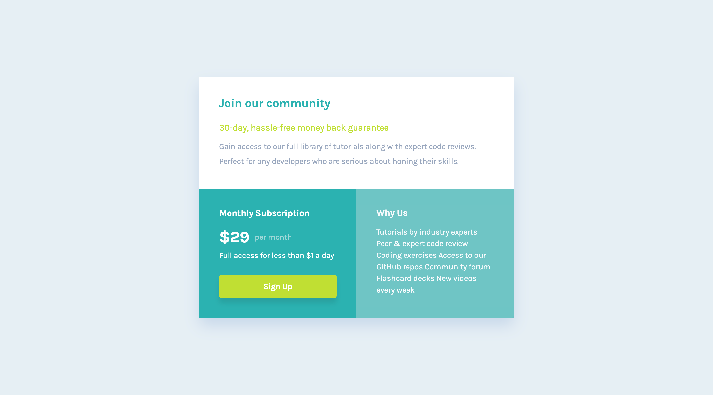

# Frontend Mentor - Single price grid component solution

## Welcome! 👋

# Frontend Mentor - Single price grid component solution

This is a solution to the [Single price grid component challenge on Frontend Mentor](https://www.frontendmentor.io/challenges/single-price-grid-component-5ce41129d0ff452fec5abbbc). Frontend Mentor challenges help you improve your coding skills by building realistic projects.

### The challenge

Users should be able to:

- View the optimal layout for the component depending on their device's screen size
- See a hover state on desktop for the Sign Up call-to-action

## Live site

🚀 [https://waquintero-ia.github.io/singlePrice/]()

## Solution URL
🚀 

## Author

- Frontend Mentor - [@waquintero-ia](https://www.frontendmentor.io/profile/yourusername)

### Screenshot

Desktop

Mobile

